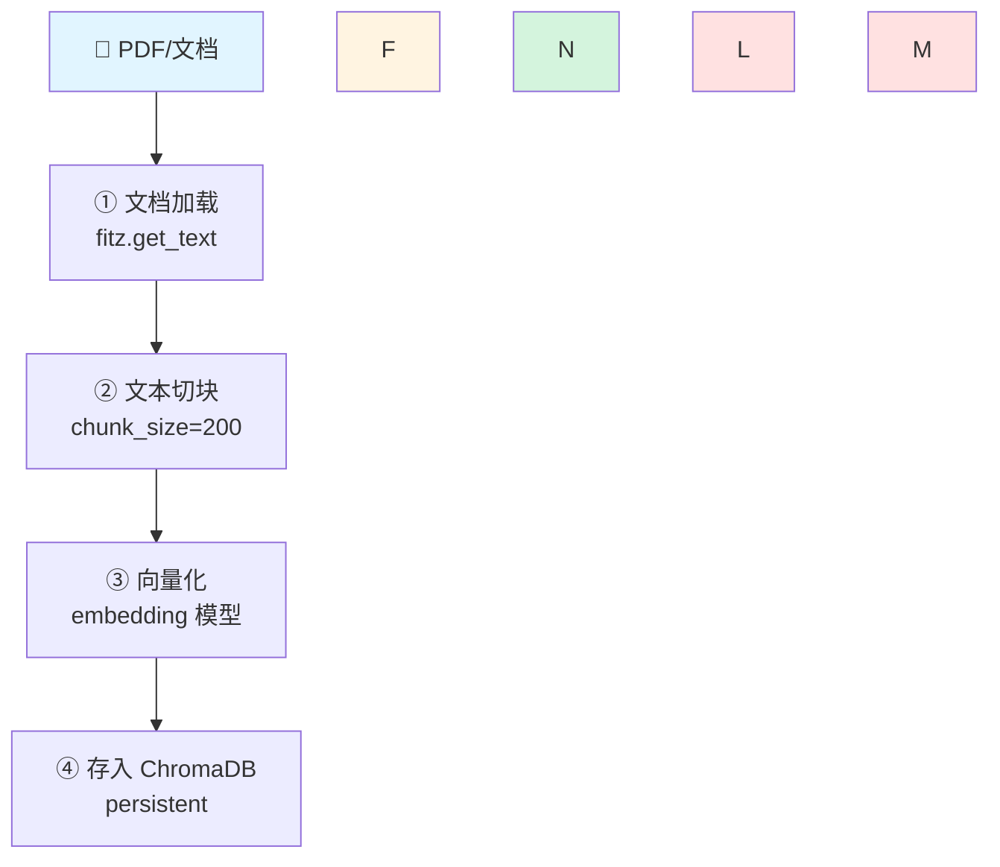

# W10-D7｜RAG 完整流程图（ASCII + Mermaid 双版本）

> D7 不写新代码，把 W10 一周学的「离线建库 + 在线检索」画成一张图串起来。
> 代码载体：`~/ai-assistant/w10_d7_rag_flowchart.py`（纯 print 大段字符串，零依赖）

---

## 一、知识整合（5 条核心）

### 1. RAG 分两大阶段
- **离线建库**（一次性/定期）：文档加载 → 切块 → 向量化 → 存库
- **在线检索**（每次提问）：问题向量化 → 相似度搜索 → 距离过滤 → metadata 过滤 → 拼 Prompt 给 LLM

### 2. 离线 vs 在线的边界
- 离线阶段**完全不碰 LLM**，纯工程（读文件/切文本/embedding/入库）
- 在线阶段前半段（检索）也**不碰 LLM**，只有最后拼 Prompt 才进 LLM
- **W11 要加的，就是"检索结果 → LLM 生成答案"这最后一段**

### 3. 检索质量决定 RAG 天花板（呼应 D1/D6）
- 召回的块烂，LLM 再强也答不对（垃圾进垃圾出）
- 距离阈值、metadata 过滤都是"质量门"，卡掉不相关的块

### 4. chunk_size 不是越大越好（呼应 D5）
- 小（100）：块多但语义破碎，top-1 集中
- 大（200）：块少语义完整，但样本少检索信号弱
- 生产建议 500-1000，文档至少 5000+ 字

### 5. W11 衔接点
```
[D5+D6 检索] → top_k 候选块 → 拼 Prompt → DeepSeek API → 结构化答案
```
D5+D6 的代码 = W11 的"检索地基"，差的就是 LLM 那一层。

---

## 二、离线建库阶段（ASCII）

```
╔══════════════════════════════════════════════════════════════════╗
║           RAG 离线建库阶段（数据预处理，一次或定期重跑）             ║
╚══════════════════════════════════════════════════════════════════╝

  [PDF/Markdown/网页]                           数据源
        │
        ▼
  ┌─────────────┐
  │ ① 文档加载  │ ← W10-D3：fitz(pymupdf) 读 PDF
  └─────┬───────┘
        │ 纯文本
        ▼
  ┌─────────────┐
  │ ② 文本切块  │ ← W10-D4：chunk_size=200 overlap=30
  └─────┬───────┘   （中文长文建议 500-1000）
        │ chunks[] 字符串列表
        ▼
  ┌─────────────┐
  │ ③ 向量化    │ ← W10-D2：embedding 模型
  └─────┬───────┘   （中文推荐 BAAI/bge-small-zh）
        │ 384 维浮点向量
        ▼
  ┌─────────────────────────┐
  │ ④ 存入向量数据库         │ ← W10-D5：chroma.PersistentClient
  │  (chroma_db/xx.pdf)      │
  │  - documents: 文本       │
  │  - metadatas: {来源,编号}│
  │  - ids: chunk_0, chunk_1│
  └─────────────────────────┘
        │
        ▼
  持久化到磁盘（重启后能复用）
```

---

## 三、在线检索阶段（ASCII）

```
╔══════════════════════════════════════════════════════════════════╗
║          RAG 在线检索阶段（用户每次提问都跑）                       ║
╚══════════════════════════════════════════════════════════════════╝

  用户问：「直播带货的复盘指标有哪些？」
        │
        ▼
  ┌──────────────┐
  │ ① 问题向量化 │ ← 同一个 embedding 模型
  └─────┬────────┘
        │ 1 个 384 维向量
        ▼
  ┌──────────────────────────┐
  │ ② 向量库相似度搜索        │ ← collection.query()
  │  - 算 L2/cosine 距离      │    默认 L2，越小越相似
  │  - 按距离排序             │
  │  - 取 top-k（通常 3-5）   │
  └─────┬────────────────────┘
        │ 候选块 + 距离
        ▼
  ┌──────────────────────────┐
  │ ③ 距离过滤（质量门）      │ ← W10-D6 知识整合 ⑤
  │  - 距离 < 1.0  → 保留     │   "距离"反映相对相似度
  │  - 距离 > 1.3  → 丢弃     │   样本少时会"凑数"
  └─────┬────────────────────┘
        │ 留下来的高相关块
        ▼
  ┌──────────────────────────┐
  │ ④ metadata 二次过滤（可选）│
  │  where={"来源": "xx.pdf"}│ ← 缩小检索范围
  └─────┬────────────────────┘
        │
        ▼
  拼成 Prompt，喂给 LLM 生成答案  ← W11 要学的
```

---

## 四、W11 衔接（ASCII）

```
╔══════════════════════════════════════════════════════════════════╗
║            W11 预告：在第②步后面挂上 LLM                          ║
╚══════════════════════════════════════════════════════════════════╝

  [D5+D6 的检索]
        │
        │  top_k 个块
        ▼
  ┌────────────────────────────────────────────┐
  │  拼 Prompt：                                │
  │  ┌──────────────────────────────────────┐  │
  │  │ 基于以下资料回答问题（禁止编造）：      │  │
  │  │                                       │  │
  │  │ [1] 复盘的六大指标：场观、停留时长、   │  │
  │  │     转化率、客单价、GMV、退货率。      │  │
  │  │ [2] 场观是基础指标，反映流量规模；     │  │
  │  │     停留时长反映内容吸引力。           │  │
  │  └──────────────────────────────────────┘  │
  └─────────────────┬──────────────────────────┘
                    │
                    ▼
              openai SDK（v3.0.0）
                    │
                    ▼
              DeepSeek API
                    │
                    ▼
              返回结构化答案
```

---

## 五、Mermaid 版（贴到 mermaid.live 或腾讯文档渲染）



---

## 六、复盘三问

1. **Q**：为什么 D7 不写新代码，只画流程图？
   **A**：W10 一周学的都是"零件"（加载/切块/向量化/入库/检索/过滤），D7 是把零件拼成整机看全貌。画图比写码更适合"总览"。

2. **Q**：离线建库和在线检索，哪段最影响质量？
   **A**：都影响，但**检索质量（在线阶段）决定天花板**——块切得再好，检索没卡住距离阈值/没过滤，LLM 也会拿到烂上下文。

3. **Q**：W11 和 W10 的边界在哪？
   **A**：W10 = 到"检索出 top-k 块"为止。W11 = 把 top-k 块拼进 Prompt 交给 LLM 生成答案，还要带"出处引用"。

---

## 七、下一步

- **W11（明天 03:00）**：完整 RAG 问答系统 = D5+D6 检索 + LLM 生成 + 带出处答案
- **真实数据**：朋友公司的产品知识表 + 历史弹幕（见 W10-D5-D6 文件的"RAG 库怎么搭"）
- **周总文档** `10-Week10-向量库.md`：保持占位，周日整周学完才汇总 D1-D7 + 复习清单
