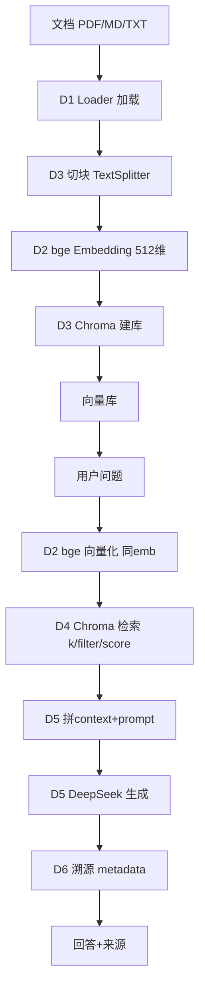

# W11-D7 RAG 流程图（收官）（2026-08-22）

> 前置：W11-D1~D6。今日：画 RAG 全链路流程图，把六块技术串成一张图收官。

---

## ASCII 流程图

```
┌───────────────── 离线建库 (D1→D3) ─────────────────┐
│                                                       │
│  文档(PDF/MD/TXT)                                     │
│       │                                               │
│       ▼                                               │
│  [D1] Loader 加载 (PyMuPDF / pypdf / docx2txt)        │
│       │                                               │
│       ▼                                               │
│  [D3] 切块 RecursiveCharacterTextSplitter             │
│       │     (chunk_size / overlap)                    │
│       ▼                                               │
│  [D2] bge Embedding (BAAI/bge-small-zh, 512维)       │
│       │                                               │
│       ▼                                               │
│  [D3] Chroma 建库 from_documents(embedding=emb)       │
│       │     persist_directory 落盘                    │
│       ▼                                               │
│  向量库 (可检索)                                       │
└───────────────────────────────────────────────────────┘
                        │
                        ▼
┌───────────────── 在线问答 (D4→D6) ─────────────────┐
│                                                       │
│  用户问题                                             │
│       │                                               │
│       ▼                                               │
│  [D2] bge 向量化 (同一 emb 对象!)                    │
│       │                                               │
│       ▼                                               │
│  [D4] Chroma 检索 similarity_search                   │
│       │     (k / filter 硬约束 / score 自己过滤)      │
│       ▼                                               │
│  [D5] 拼 context + prompt (不知道就说不知道)         │
│       │                                               │
│       ▼                                               │
│  [D5] DeepSeek 生成 (base_url 不带/v1, temp=0)       │
│       │                                               │
│       ▼                                               │
│  [D6] 溯源 retriever metadata → src                  │
│       │                                               │
│       ▼                                               │
│  回答 + 来源                                          │
└───────────────────────────────────────────────────────┘
```

## Mermaid 流程图



---

## D1-D6 一句话串联

- **D1** 把文档读进来 → **D3** 切块 → **D2** 用 bge 变向量 → **D3** 存进 Chroma
- 问答时：问题经 **D2** 同 emb 向量化 → **D4** 检索最相关块 → **D5** 喂给 DeepSeek 基于文档答 → **D6** 标来源

---

## 收官确认

W11 D1-D7 全通（Loader→Embedding→建库→检索→闭环→溯源→流程图）。凌晨连轴 3.5+ 小时，六块技术 + 收官图扎实。
